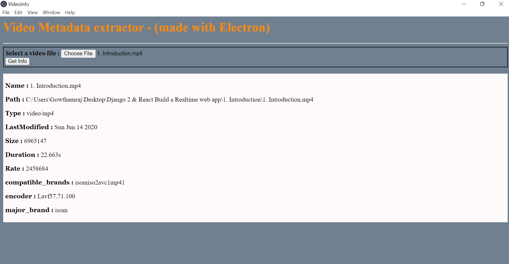

# Electronjs VideoInfo App
> This app gets the medadata of any video uploaded to it. i have used `Electronjs` for making the application.

## Few metadata:
    1.lastModified
    2.name
    3.path
    4.type
    5.size

## requirements:
```sh
    1.ffmpeg
        for installation : `https://www.ffmpeg.org/download.html`
    2.fluent-ffmpeg
    3.Electron
```

## ScreenShot
    